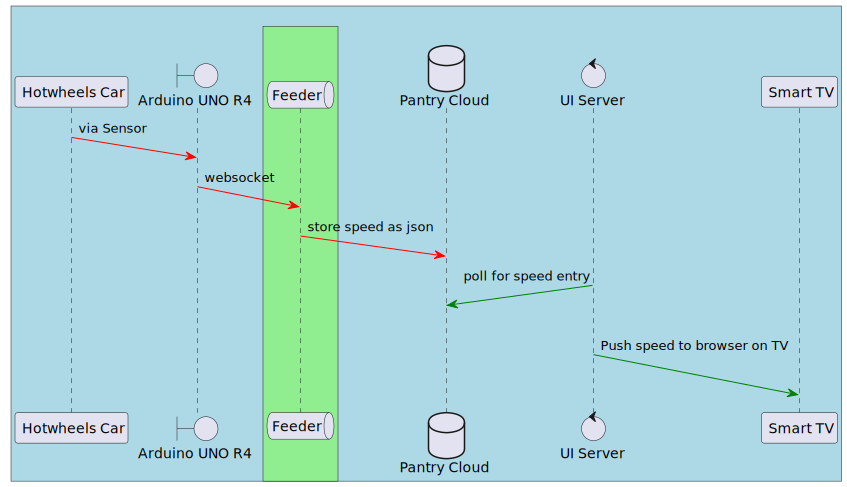

# Feeder

Feeder is a NodeJS Websocket server responsible for relaying speed measured in  [Arduino UNO R4 Wifi](https://store-usa.arduino.cc/products/uno-r4-wifi?srsltid=AfmBOoo5YGjWqsMl9Naq7qn4-xV415hl1xPWvdJsnfXqoOrlBt2TSmgk) to [Pantry Cloud](https://getpantry.cloud/) storage. Please refer to the diagram below to understand Feeder component in the whole ecosystem.



### Components Repositories
1. [Arduino Speedometer Code](https://github.com/MurlidharVarma/arduino)
1. [Feeder](https://github.com/MurlidharVarma/feeder)
1. [UI Server](https://github.com/MurlidharVarma/json-store-ui)


## Usage
### 1. Clone the repo
```
git clone https://github.com/MurlidharVarma/feeder.git
```

### 2. Install Node packages
Require [Node](https://nodejs.org/en/download) installed on your system.
```
cd feeder
npm install
```

### 2. Start server
```
npm start
```
